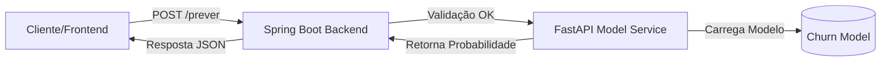

<div align="center">
    
    <h2>Previsão Inteligente de Cancelamento (Churn)</h2>
</div>

<div align="center">
  &nbsp;&nbsp;
  &nbsp;&nbsp;
  &nbsp;&nbsp;
  &nbsp;&nbsp;
  
</div>

<div align="center">
  &nbsp;&nbsp;
  &nbsp;&nbsp;
  &nbsp;&nbsp;
  &nbsp;&nbsp;
  
</div>

## O Desafio: A Retenção Reativa

No setor de Telecomunicações, a maioria das ações de retenção ocorre tarde demais: apenas quando o cliente entra em contato para cancelar. Essa abordagem reativa gera custos operacionais elevados e baixa taxa de reversão. O verdadeiro problema não é a saída do cliente, mas a incapacidade de identificar **sinais silenciosos de insatisfação** antes que a decisão de cancelamento seja tomada.

## A Solução: Reter+

O **Reter+** é um motor de inteligência preditiva projetado para transformar a retenção de reativa para **proativa**.

Utilizando algoritmos de Machine Learning treinados em dados comportamentais e financeiros, o sistema atua como um "radar de risco", classificando a base de clientes em tempo real.

**Como funciona a entrega de valor:**

1. **Scoring de Risco:** Cada cliente recebe uma probabilidade de evasão (0-100%), permitindo que as equipes de marketing foquem recursos apenas nos casos críticos.
2. **Classificação Binária:** O sistema aplica um limiar de decisão (threshold) otimizado para maximizar a captura de churners reais (Recall), categorizando o cliente explicitamente como "Em Risco" ou "Seguro".

### Arquitetura da Solução

Adotamos uma arquitetura de **Microserviços** para separar responsabilidades e garantir escalabilidade:

1. **Backend (Gateway & Orchestrator):** Desenvolvido em **Java/Spring Boot**. Responsável por receber requisições, validar dados (Bean Validation), segurança e orquestrar a chamada ao modelo.
2. **Model API (Inference Engine):** Desenvolvido em **Python/FastAPI**. Responsável por carregar o modelo treinado (`.joblib`) e realizar a inferência matemática.



---

## Performance do Modelo (Data Science)

O modelo foi treinado utilizando o dataset clássico **Telco Customer Churn**, passando por etapas de limpeza, análise exploratória, treinamento e seleção de modelos.

Abaixo, os resultados preliminares nos dados de teste:

| Métrica | Resultado | Significado para o Negócio |
| --- | --- | --- |
| **Acurácia** | **XX%** | Taxa global de acertos do modelo. |
| **Precision** | **XX%** | *("De quem alertamos que sairia, quantos realmente saíram?")*  Evita gastar orçamento de retenção com quem não precisava. |
| **Recall** | **XX%** | *("De todos que saíram, quantos o modelo detectou?")*  A métrica mais crítica: garante que não deixamos clientes insatisfeitos passarem despercebidos. |
| **F1-Score** | **XX%** | O equilíbrio entre precisão e recall. |

> *Para detalhes da modelagem e EDA, acesse: [`Documentação de Análise Exploratória e Modelagem`](https://github.com/windsonPatricio/Hackathon-TelcoCustomerChurn/blob/dev/ml/notebooks/README.md)

---

## Execução via Docker Compose

A forma mais simples de rodar a solução completa (**Backend + ML**) é utilizando o Docker Compose.

### Pré-requisitos

* [Docker](https://www.docker.com/) & Docker Compose instalados e rodando.

### Passo a Passo

1. **Clone o repositório:**

```bash
git clone https://github.com/windsonPatricio/Hackathon-TelcoCustomerChurn.git

```

2. **Navegue até o diretório raiz do projeto:**

```bash
cd Hackathon-TelcoCustomerChurn

```

3. **Execute o Docker Compose:**

```bash
docker-compose up --build

```

> **Nota:** *Este comando irá construir a imagem do serviço Python (ML) e compilar/subir a aplicação Java (Backend).*

4. **Acesse as APIs:**

Após a inicialização, os serviços estarão disponíveis nas seguintes portas:

* **Backend Java (Principal):** `http://localhost:8080`   (Se estiver exposta no `docker-compose.yml`)
* **Model API (Interna):** `http://localhost:8000`

---

## API Endpoints

### 1. Previsão de Churn (Backend)

Este é o endpoint principal que deve ser consumido pelo front-end ou clientes externos.

* **URL:** `POST http://localhost:8080/reter/prever`
* **Content-Type:** `application/json`

**Exemplo de Requisição:**

``` bash
curl -X POST http://localhost:8080/reter/prever \
-H "Content-Type: application/json" \
-d '{
  "genero": "homem",
  "idoso": 0,
  "parceiro": 1,
  "dependentes": 0,
  "tempo_contrato_meses": 12,
  "servico_telefone": 1,
  "linhas_multiplas": "nao",
  "tipo_internet": "fibra",
  "seguranca_online": "sim",
  "backup_online": "nao",
  "protecao_dispositivo": "nao",
  "suporte_tecnico": "nao",
  "streaming_tv": "sim",
  "streaming_filmes": "sim",
  "tipo_contrato": "mensal",
  "cobranca_digital": 1,
  "metodo_pagamento": "cheque_eletronico",
  "cobranca_mensal": 79.85,
  "cobranca_total": 1200.50
  }'
```

**Exemplo de Resposta:**

```json
{
  "previsao": "Vai cancelar",
  "probabilidade": 0.81
}

```

---

## Estrutura do Repositório

O projeto está organizado em três contextos principais: **Backend**, **Machine Learning** e **Documentação/Configurações**.

```text
.
├── .github/
│   └── workflows/
│       └── ml-ci.yml                   # Pipeline de CI para o módulo ML
│
├── api-backend/                        # MÓDULO BACKEND (Java + Spring Boot)
│   ├── src/main/java/.../retermais/
│   │   ├── client/                     # FastApiClient (Comunicação com Python)
│   │   ├── controller/                 # ReterMaisController (Endpoints)
│   │   ├── dtos/                       # Objetos de transferência de dados
│   │   ├── model/                      # Entidades e Enums
│   │   └── service/                    # Regras de negócio
│   └── pom.xml                         # Dependências Maven
│
├── docs/                               # Documentação Geral
│   └── model-api-contract.md           # Contrato de Interface (JSON Java <-> Python)
│
├── ml/                                 # MÓDULO DATA SCIENCE (Python)
│   ├── data/
│   │   ├── processed/                  # Dados limpos e otimizados (formato Parquet)
│   │   └── raw/                        # Dataset original (CSV) da Telco Customer Churn
│   │
│   ├── model_api/                      # Microserviço de Inferência (FastAPI)
│   │   ├── models/                     # Cópia do modelo serializado para produção
│   │   ├── tests/                      # Testes unitários e de integração (Pytest)
│   │   ├── app.py                      # Entrypoint da API (Rotas e Inicialização)
│   │   ├── config.py                   # Variáveis de configuração e ambiente
│   │   ├── Dockerfile                  # Definição da imagem Docker para deploy
│   │   ├── inference.py                # Lógica de negócio: Carregamento e Predição
│   │   ├── pyproject.toml              # Dependências enxutas específicas para a API
│   │   └── schemas.py                  # Contratos de dados e validação (Pydantic)
│   │
│   ├── models/                         # Diretório central de modelos treinados (.joblib)
│   │
│   └── notebooks/                      # Ambiente de Experimentação (EDA e Prototipagem)
│       ├── 01_eda.ipynb                # Análise Exploratória e Feature Engineering
│       ├── 02_churn_modeling.ipynb     # Treinamento, Validação e Serialização
│       └── pyproject.toml              # Dependências específicas para análise de dados
│
└── docker-compose.yml                  # Orquestração dos containers (App + ML)
```

---

## Tecnologias Utilizadas

### Backend

* **Java 21**
* **Spring Boot 3.3** (Web, Validation, DevTools)
* **Lombok**
* **Maven**

### Data Science & ML

* **Python 3.11**
* **Scikit-Learn** (pipelines, modelagem)
* **Pandas & Numpy**
* **FastAPI** (Serviço de Inferência)
* **uv** (Gerenciador de pacotes Python moderno)

---

## Equipe

* **Time Backend:** Resposável pelo desenvolvimento do serviço principal em Java/Spring Boot.
* **Time Data Science:** Responsável pela análise de dados, treinamento do modelo e API Python.

## Time

| Colaborador | Função | GitHub |
| :--- | :--- | :--- |
| **Augusto Brandão** | Backend Developer | [@gutoobrandao](https://github.com/gutoobrandao) |
| **Windson Patricio** | Backend Developer | [@windsonPatricio](https://github.com/windsonPatricio) |
| **Brizza Nathielly** | Backend Developer | [@whoisbrizza](https://github.com/whoisbrizza) |
| **Lucas Zimmermann** | Backend Developer | [@zzzimmer](https://github.com/zzzimmer) |
| **Marcelle Carolina** | Data Scientist | [@Marcellecarol](https://github.com/Marcellecarol) |
| **Joel Victor** | Data Scientist | [@jvsobrinho](https://github.com/jvsobrinho) |

---
