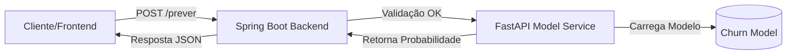

<div align="center">
    
    <h2>Previsão Inteligente de Cancelamento (Churn)</h2>
</div>

<div align="center">
    &nbsp;
    &nbsp;
    &nbsp;
    &nbsp;
    &nbsp;
    &nbsp;
    &nbsp;
    &nbsp;
    
</div>

## O Desafio: A Retenção Reativa

No setor de Telecomunicações, a maioria das ações de retenção ocorre tarde demais: apenas quando o cliente entra em contato para cancelar. Essa abordagem reativa gera custos operacionais elevados e baixa taxa de reversão. O verdadeiro problema não é a saída do cliente, mas a incapacidade de identificar **sinais silenciosos de insatisfação** antes que a decisão de cancelamento seja tomada.

## A Solução: Reter+

O **Reter+** é um motor de inteligência preditiva projetado para transformar a retenção de reativa para **proativa**.

Utilizando algoritmos de Machine Learning treinados em dados comportamentais e financeiros, o sistema atua como um "radar de risco", classificando a base de clientes em tempo real.

**Como funciona a entrega de valor:**

1. **Scoring de Risco:** Cada cliente recebe uma probabilidade de evasão (0-100%), permitindo que as equipes de marketing foquem recursos apenas nos casos críticos.
2. **Classificação Binária:** O sistema aplica um limiar de decisão (threshold) otimizado para maximizar a captura de churners reais (Recall), categorizando o cliente explicitamente como "Em Risco" ou "Seguro".

### Arquitetura da Solução

Adotamos uma arquitetura de **Microserviços** para separar responsabilidades e garantir escalabilidade:

1. **Frontend (Interface Web):** Desenvolvido com HTML5 e CSS com framework Bootstrap. Responsável por enviar os dados via JSON para o endpoint de predição e exibe o resultado em tempo real.
2. **Backend (Gateway & Orchestrator):** Desenvolvido em **Java/Spring Boot**. Responsável por receber requisições, validar dados (Bean Validation), segurança e orquestrar a chamada ao modelo.
3. **Model API (Inference Engine):** Desenvolvido em **Python/FastAPI**. Responsável por carregar o modelo treinado (`.joblib`) e realizar a inferência matemática.



Para detalhes específicos de integração, consulte:

- [**Referência da API e Contratos:**](/docs/api-info-contract.md) Endpoints, tipos de dados e campos obrigatórios.
- [**Guia de Erros e Status Codes:**](/docs/error-codes.md) Padrões de resposta para validações e falhas de integração.
- [**Performance do Modelo:**](/docs/model.md) Métricas de Acurácia, Precision e Recall.

---

## Execução via Docker Compose

A forma mais simples de rodar a solução completa (**Frontend + Backend + ML**) é utilizando o Docker Compose.

### Pré-requisitos

* [Docker](https://www.docker.com/) & Docker Compose instalados e rodando.

### Passo a Passo

1. **Clone o repositório:**

```bash
git clone https://github.com/windsonPatricio/Hackathon-TelcoCustomerChurn.git

```

2. **Navegue até o diretório raiz do projeto:**

```bash
cd Hackathon-TelcoCustomerChurn

```

3. **Execute o Docker Compose:**

```bash
docker-compose up --build

```

> **Nota:** *Este comando irá construir a imagem do serviço Python (ML) e compilar/subir a aplicação Java (Backend).*

4. **Acesse as APIs:**

Após a inicialização, os serviços estarão disponíveis nas seguintes portas:

- **Frontend (Principal):** `http://localhost`  
- **Backend Java:** `http://localhost:8080`
- **Model API (Interna):** `http://localhost:8000`

---

## Tecnologias Utilizadas

### Frontend

- **HTML5**
- **CSS**
- **JavaScript**
- **Axios**
- **Nginx**

### Backend

- **Java 21**
- **Spring Boot 4.0.0**
- **Spring Boot Starter Web:** (MVC e Tomcat)
- **Spring Boot Starter Validation:** (Bean Validation / Hibernate Validator)
- **Spring Boot DevTools:** (Hot reload)
- **Spring Swagger:** (Documentação de API)
- **Maven**

### Data Science & ML

- **Python 3.11**
- **Scikit-Learn** (pipelines, modelagem)
- **Pandas & Numpy**
- **FastAPI** (Serviço de Inferência)
- **uv** (Gerenciador de pacotes Python moderno)

---

## Equipe

Trabalho desenvolvido em conjunto pelos times de Backend e Data Science.

| Colaborador | Função | GitHub |
| :--- | :--- | :--- |
| **Augusto Brandão** | Backend Developer | [@gutoobrandao](https://github.com/gutoobrandao) |
| **Windson Patricio** | Backend Developer | [@windsonPatricio](https://github.com/windsonPatricio) |
| **Brizza Nathielly** | Backend Developer | [@whoisbrizza](https://github.com/whoisbrizza) |
| **Lucas Zimmermann** | Backend Developer | [@zzzimmer](https://github.com/zzzimmer) |
| **Marcelle Carolina** | Data Scientist | [@Marcellecarol](https://github.com/Marcellecarol) |
| **Joel Victor** | Data Scientist | [@jvsobrinho](https://github.com/jvsobrinho) |
